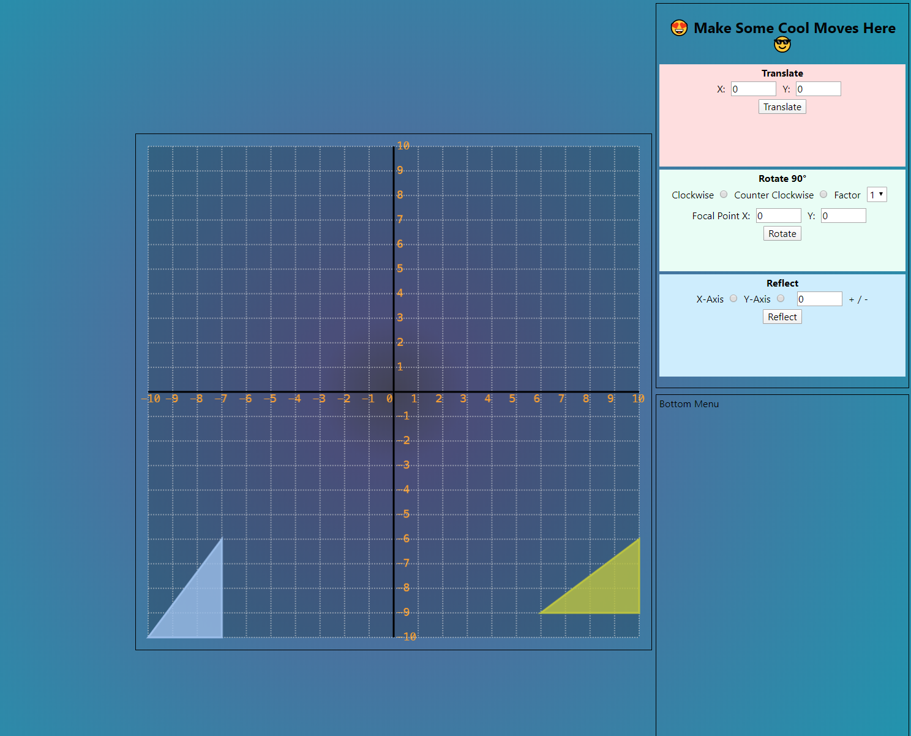
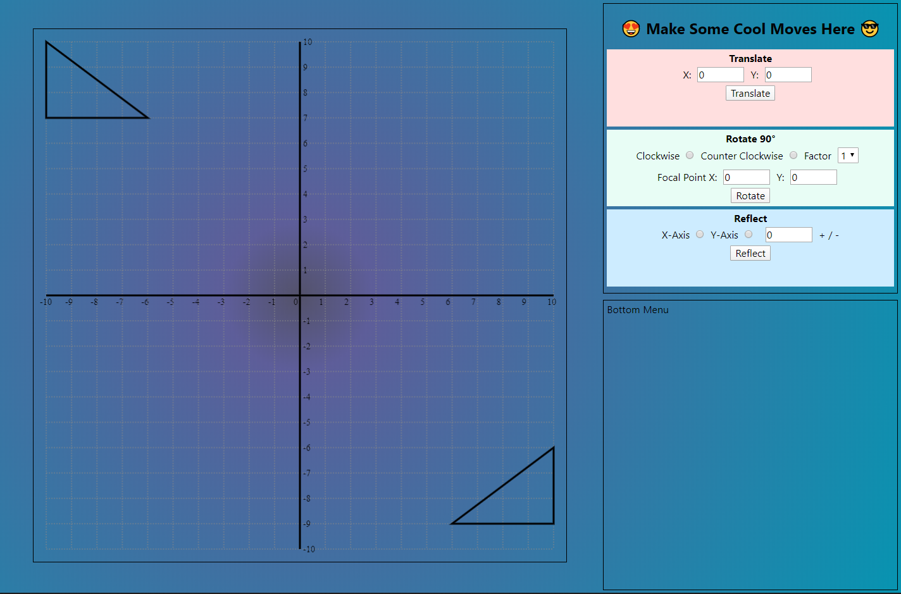

# Dev Notes

### 2020-01-23



```js
d.drawGrid({
  ctx,
  labelFillStyle: "orange",
  lineStyle: "#ddd",
  fillStyle: "rgba(0,0,0,.2)"
});


d.drawAxis({ ctx, lineStyle: "#000" });

d.drawTriangle({
  ...props.triangleCoords,
  ctx,
  lineStyle: "rgb(155,189,238)",
  fillStyle: "rgba(155, 189,238,0.8)"
});

//draw winning triangle
d.drawTriangle({
  ...mapToCanvasCoords(props.target),
  ctx,
  lineStyle: "rgb(188,198,34)",
  fillStyle: "rgba(188,198,34, 0.8)"
});
```

### 2020-01-22



### Features

<!-- Needs comments here -->

### 2020-01-19


### Features

- Customizable Transformations

### To implement next

- Front end:
  - collision detection
  - game winning/losing logic
  - drag + drop
  - visual improvements
  - transition b/t levels
  - starting page
  - background effects
- Back end
  - user sign in

### 2020-01-15

`52bd7f2`: https://github.com/jmoore-code/mindFuelProject/commit/52bd7f25aea0eead1337ccc3d4ea342d9d931383


### Features

- Customizable grid-size

### To implement (by 2020-01-30)

- ~~Transformations~~
  - ~~Translation~~
  - ~~Rotation~~
  - ~~Reflection~~
