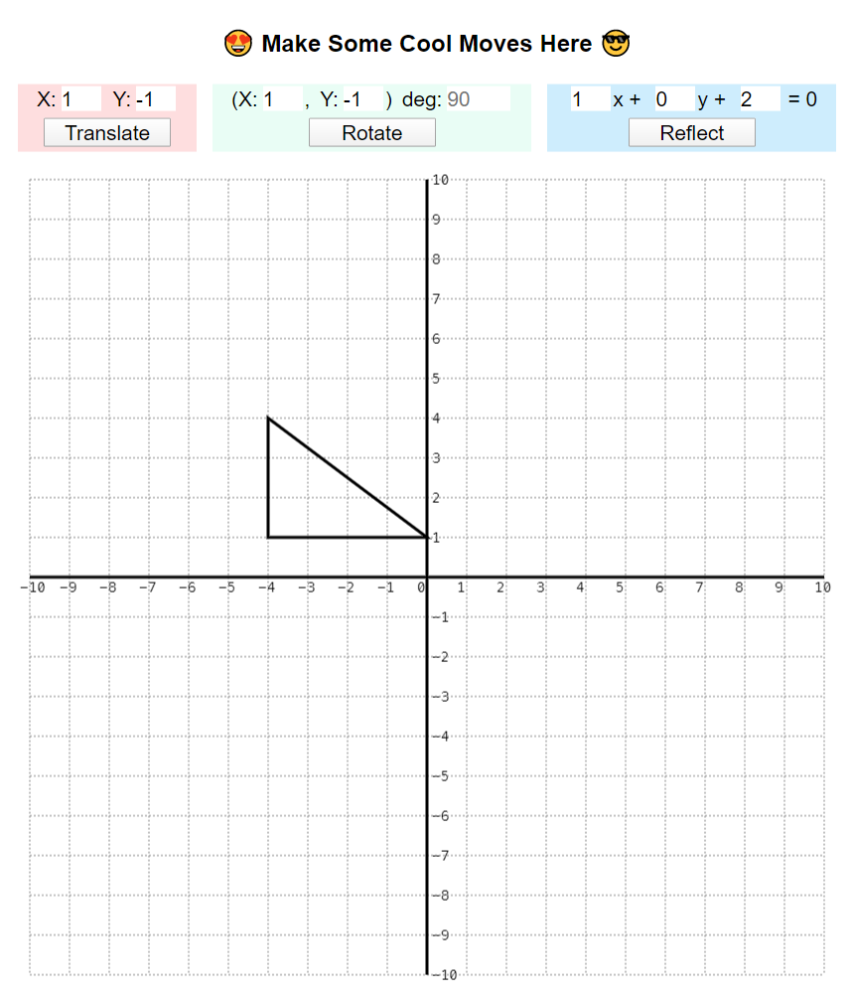
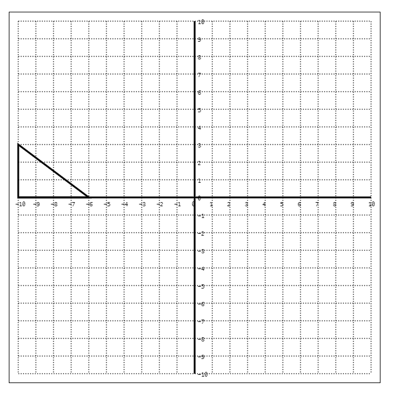

# Dev Notes

### 2020-01-19

### Features

- Cusomizable Transformations

### To implement next

- Front end:
  - collision detection
  - game winning/losing logic
  - drag + drop
  - visual improvements
  - transition b/t levels
  - starting page
  - background effects
- Back end
  - user sign in

### 2020-01-15

`52bd7f2`: https://github.com/jmoore-code/mindFuelProject/commit/52bd7f25aea0eead1337ccc3d4ea342d9d931383

### Features

- Customizable grid-size

### To implement (by 2020-01-30)

- ~~Transformations~~
  - ~~Translation~~
  - ~~Rotation~~
  - ~~Reflection~~
