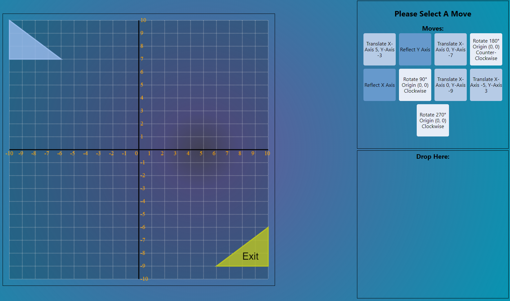

# Dev Notes

### 2020-03-12


### Features

- Firebase, React Router added
- Mountain Theme/Customizable Level Themes
- Level Improvements, Visual Improvements
- Level Transitions, Level Restart Button
- Top Score Bar - Level Name, Username, Level, Score, Attempts
- Basic Score Tracking
- Basic Login Page

### To implement next

- Front end:
  - Obstacles/Collision Detection
  - Customizable Move Choices on Drag & Drop
  - Visual Improvements
  - Starting Page Improvements
  - Pre-Stage Moves --> Moves Submit Button to Activate Moves

- Back end
  - User sign in
  - Data Recording

### 2020-03-10


### Features

- Desert Theme
- Implemented PIXI.js library
- Translate, Rotate, Reflect animations
- Set custom focal point for Rotate animation

### To implement next

- Front end:
  - Collision Detection
  - Visual Improvements
  - Transition b/t Levels
  - Starting Page
  - Score
  - Pre-Stage Moves --> Moves Submit Button to Activate Moves

- Back end
  - User sign in
  - Data Recording

### 2020-02-12


### Features

- Movement Icons
- Ongoing Visual Improvements
- Level Object Packages


### To implement next

- Front end:
  - Collision Detection
  - Visual Improvements
  - Transition b/t Levels
  - Starting Page
  - Background Effects
  - Score/Timer
  - Pre-Stage Moves --> Moves Submit Button to Activate Moves

- Back end
  - User sign in

### 2020-01-29



### Features

- Transform, Rotate Animations
- Out of Bounds Lose Condition
- CSS, Visual Improvements


### To implement next

- Front end:
  - Collision Detection
  - Visual Improvements
  - Transition b/t Levels
  - Starting Page
  - Background Effects

- Back end
  - User sign in

### 2020-01-27


### Features

- Drag and Drop UI + Functionality
- Winning Logic


### To implement next

- Front end:
  - Collision Detection
  - Losing Logic
  - Visual Improvements
  - Transition b/t Levels
  - Starting Page
  - Background Effects
  - Shape Animations

- Back end
  - User sign in

### 2020-01-23


```js
d.drawGrid({
  ctx,
  labelFillStyle: "orange",
  lineStyle: "#ddd",
  fillStyle: "rgba(0,0,0,.2)"
});


d.drawAxis({ ctx, lineStyle: "#000" });

d.drawTriangle({
  ...props.triangleCoords,
  ctx,
  lineStyle: "rgb(155,189,238)",
  fillStyle: "rgba(155, 189,238,0.8)"
});

//draw winning triangle
d.drawTriangle({
  ...mapToCanvasCoords(props.target),
  ctx,
  lineStyle: "rgb(188,198,34)",
  fillStyle: "rgba(188,198,34, 0.8)"
});
```

### 2020-01-22


### Features

<!-- Needs comments here -->

### 2020-01-19


### Features

- Customizable Transformations

### To implement next

- Front end:
  - collision detection
  - game winning/losing logic
  - drag + drop
  - visual improvements
  - transition b/t levels
  - starting page
  - background effects
- Back end
  - user sign in

### 2020-01-15

`52bd7f2`: https://github.com/jmoore-code/mindFuelProject/commit/52bd7f25aea0eead1337ccc3d4ea342d9d931383


### Features

- Customizable grid-size

### To implement (by 2020-01-30)

- ~~Transformations~~
  - ~~Translation~~
  - ~~Rotation~~
  - ~~Reflection~~
